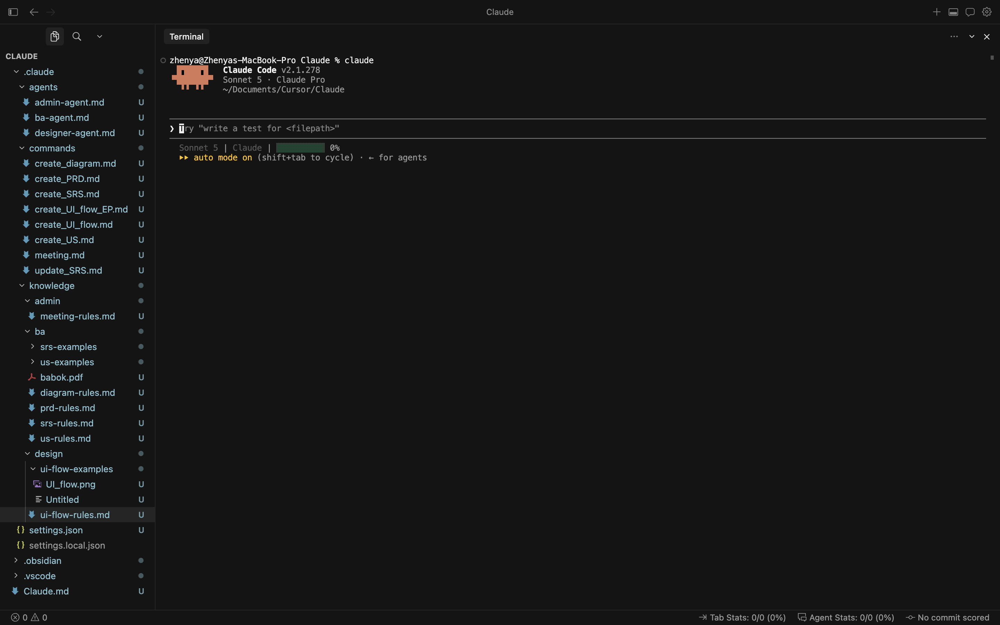
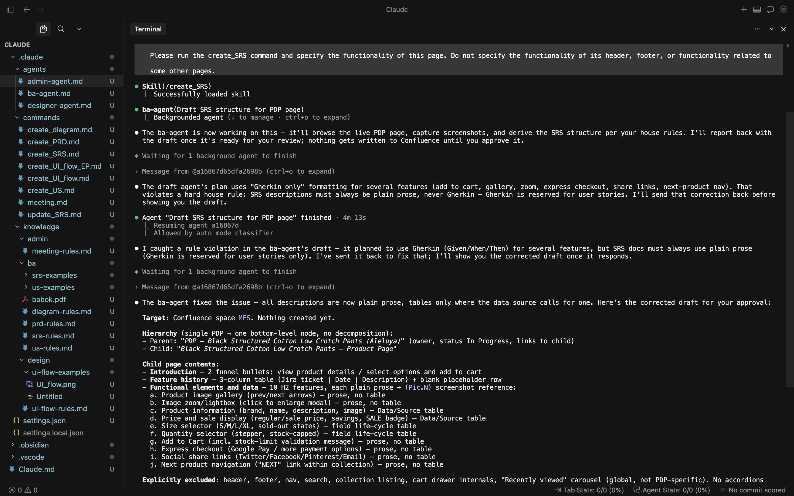
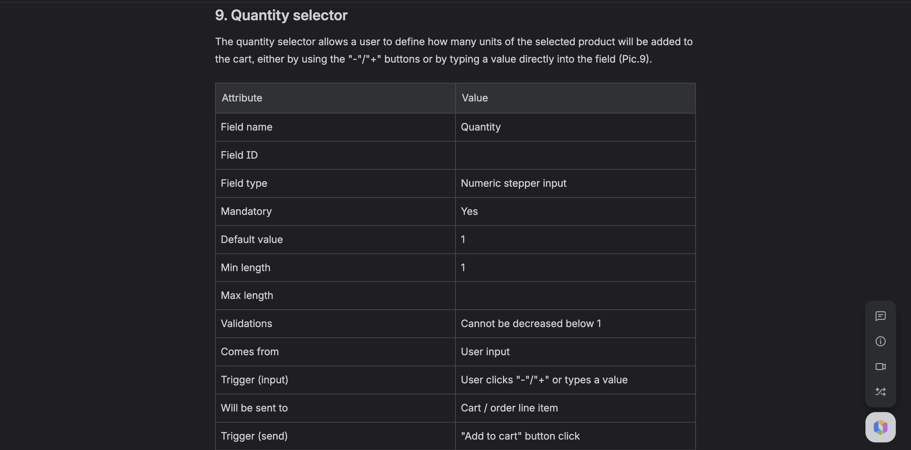
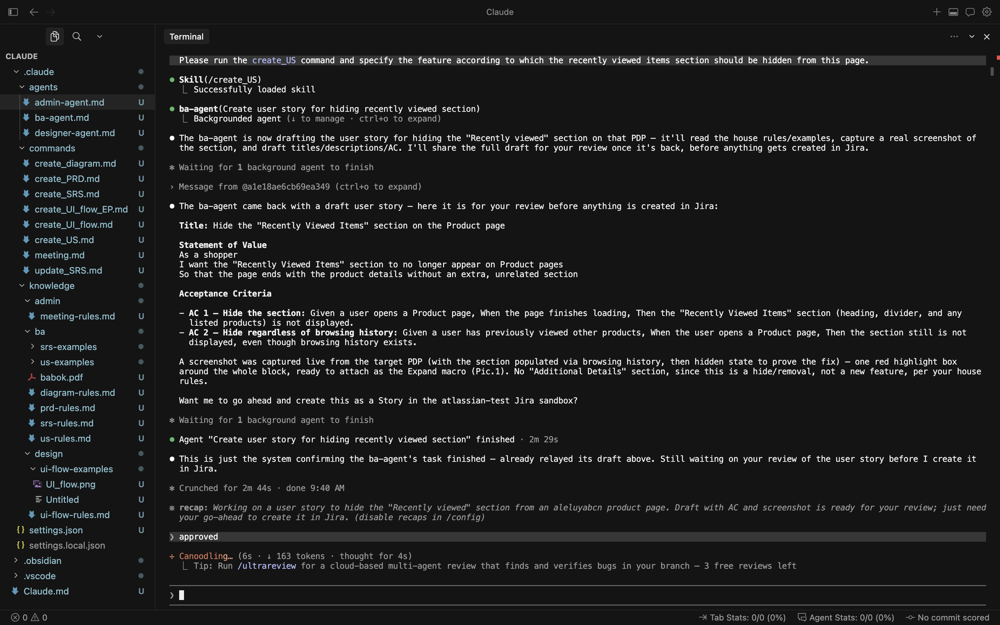
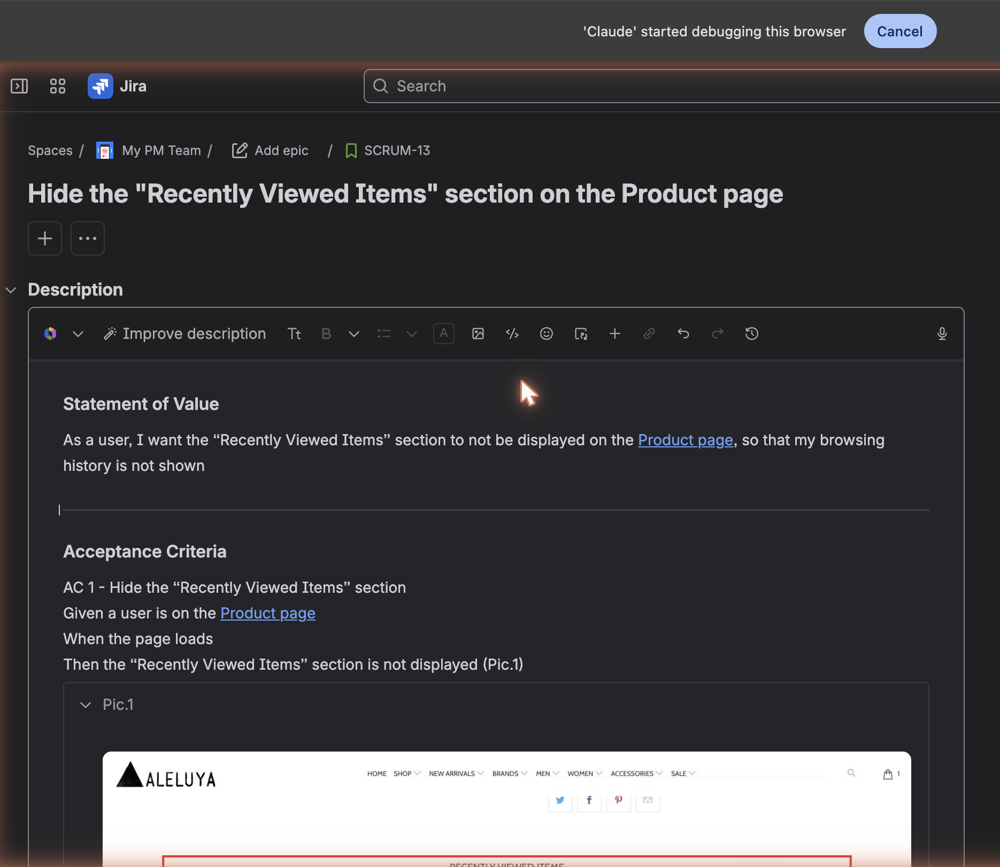
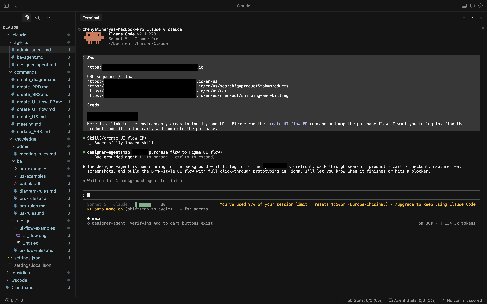
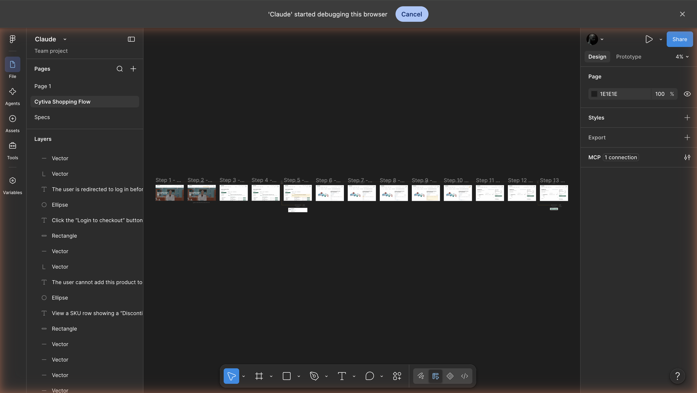
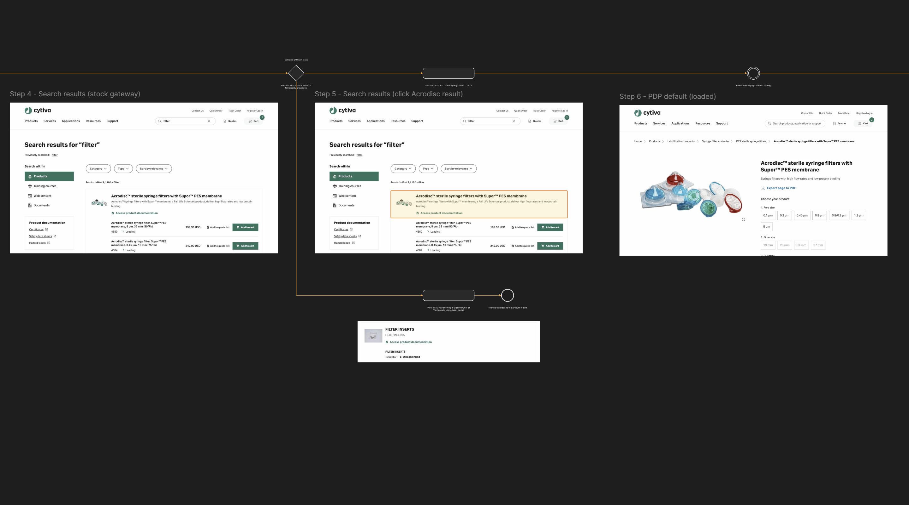

# PM AI Agents — Personal Workflow Automation

Product Manager AI agents built in Cursor to automate the mechanical parts 
of PM work — BA artifacts and design flows.

This repository shows a curated slice of the workspace I use. My live 
workspace continues to evolve — new commands are added as I identify 
workflows worth automating.

## What's here

Two specialized agents + three daily-used commands, backed by an evolving 
knowledge base of BA rules and best practices.

### 🧠 BA Agent

Creates BA artifacts — PRDs, SRS, user stories, diagrams (ERD, flowchart, 
swimlane) — following BABOK standards. Publishes to Confluence + Jira.

### 🎨 Designer Agent

Creates design artifacts — UI flows, wireframes, BPMN-style journey maps — 
in Figma, with real screenshots captured live from source URLs.

## Commands featured here

### `create_SRS`

Generates a Software Requirements Specification in Confluence from any 
input: a URL, a Figma mockup, or a free-text description.

_Agent working in the terminal — drafting the SRS and self-correcting rule 
violations before writing anything to Confluence:_

_Fragment of the published SRS in Confluence — attribute breakdown for a 
quantity selector, showing the level of field-level specification the agent 
produces:_

### `create_US`

Generates Jira user stories with proper Statement of Value + Gherkin 
acceptance criteria + inline screenshot references.

_Agent working in the terminal — drafting the user story with AC and 
capturing the referenced screenshot before publishing to Jira:_

_Published Jira story with structured Gherkin AC and inline screenshot:_

### `create_UI_flow_EP`

Maps an existing product's user flow into a BPMN-style diagram in Figma 
with real page screenshots at each step. Every BPMN shape gets its own 
screenshot below it; action steps show highlighted click targets on the 
same screenshot the action happens on. The full happy path is wired as a 
click-through prototype in Figma's Prototype tab. Useful for competitive 
analysis, benchmarking, reverse-engineering authenticated flows, and 
mapping enterprise product journeys.

_Agent working in the terminal — receiving a URL sequence + credentials 
for an authenticated test environment, and starting the mapping run 
(client identifiers redacted):_

_Figma output — overview showing the full 13-step BPMN flow generated by 
the designer-agent via the Figma MCP connection, with hundreds of 
annotations, connector arrows, and state transitions across the canvas:_

_Figma output — zoomed-in detail showing real page screenshots captured 
live, highlighted click targets on action steps, gateway diamond routing 
an edge case (Filter Inserts discontinued) below the happy path, and 
connector arrows following the layout algorithm defined in `ui-flow-rules.md`:_

## Knowledge base

The `/knowledge` folder contains the rules the agents follow:

- **`srs-rules.md`** — SRS document structure (parent → middle → child page 
  hierarchy), what goes in "Functional elements and data" tables, when to 
  use Gherkin vs plain prose, screenshot-capture rules, and update-in-place 
  rules for evolving specs
- **`us-rules.md`** — user story format (Statement of Value + numbered 
  Gherkin AC + inline "Pic.N" screenshot references), wording consistency, 
  and Jira output format
- **`ui-flow-rules.md`** — BPMN notation rules, screenshot capture method, 
  layout algorithm for gateway branches, prototype wiring, and canvas 
  organization for stacked artifacts

Sample rulesets are intentionally opinionated — this is a personal 
BABOK-inspired framework refined over months of daily use.

## Why I built this

The mechanical parts of PM work — writing specs, authoring stories, 
mapping flows — should be automated so PMs can spend more time on 
judgment, discovery, and stakeholder work. Every hour of BA-writing 
automated is an hour returned to strategy.

## Note

This is a curated slice. My live workspace has more agents (admin/meeting 
notes, more commands) — I'm sharing the mature, daily-used ones here.

## Links

- 🌐 [Portfolio](https://zhenyad.github.io/portfolio/)
- 💼 [LinkedIn](https://linkedin.com/in/dzidziguri)
- 📩 dzidziguri.ye@gmail.com
